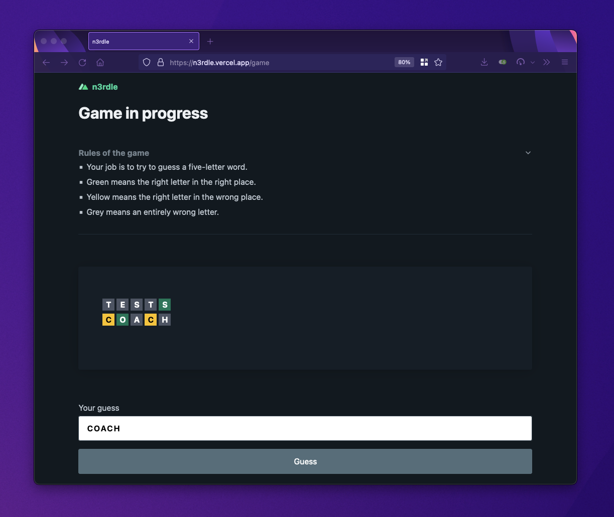

# Nuxt 3 + Wordle (n3rdle)

This is a tiny, incomplete clone of Wordle built in [Nuxt 3](https://v3.nuxtjs.org/) for a live-coding session at [Vue.js Nation 2022](https://vuejsnation.com/).

<p align="center">
  <a href="https://n3rdle.vercel.app/" target="_blank">
    
    <br>
    Live Demo
  </a>
</p>

<a href="https://www.youtube.com/watch?v=-U8NWGTGNVw" title="Vue.js Nation 2022 - Nuxt 3: From Zero to Hero">
  <p align="center">
    
  </p>
</a>

## Features

- Based on [Nuxt 3](https://v3.nuxtjs.org/)
- Server API routes using [Nuxt Nitro](https://v3.nuxtjs.org/concepts/server-engine)
- Usage of [composables](https://v3.nuxtjs.org/docs/directory-structure/composables)
- Persists an anonymous session
- Light & dark mode using [pico.css](https://picocss.com/docs/)

## Try it out

### Setup

```bash
# install dependencies
npm install # or yarn

# serve in dev mode, with hot reload at localhost:3000
npm run dev

# build for production (universal)
npm run build

# preview in production mode
npm start
```

### Deployment

You should be able to deploy this repository with zero or minimal configuration.

- [Azure](https://v3.nuxtjs.org/docs/deployment/azure)
- [Cloudflare Workers](https://v3.nuxtjs.org/docs/deployment/cloudflare)
- [Firebase Hosting](https://v3.nuxtjs.org/docs/deployment/firebase)
- [Netlify](https://v3.nuxtjs.org/docs/deployment/netlify)
- [Vercel](https://v3.nuxtjs.org/docs/deployment/vercel)
- ... and more

## License

MIT
